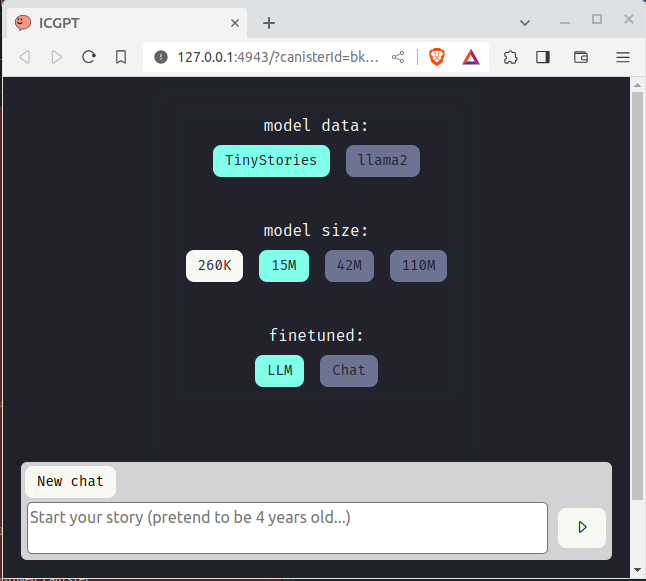

# ICGPT



---

[Try it out on the IC](https://icgpt.icpp.world) !

---

The full application consists of 3 GitHub repositories:

1. [icgpt](https://github.com/icppWorld/icgpt) (This repo)
2. [icpp_llm](https://github.com/icppWorld/icpp_llm)
3. [llama_cpp_canister](https://github.com/onicai/llama_cpp_canister)

# Setup

## Nodejs

Make sure you have nodejs installed on your system.

## Conda

[Download MiniConda](https://docs.conda.io/en/latest/miniconda.html#linux-installers) and then install it:

```bash
bash Miniconda3-xxxxx.sh
```

Create a conda environment with Python 3.11:

```bash
conda create --name icgpt python=3.11
conda activate icgpt
```

## git

Clone dependency repos:

```bash
git clone https://github.com/icppWorld/icpp_llm
# FOLLOW Set Up INSTRUCTIONS OF icpp_llm/llama2_c README !!!

git clone https://github.com/onicai/llama_cpp_canister
# FOLLOW Set Up INSTRUCTIONS OF llama_cpp_canister README !!!
```

Clone icgpt repo:

```bash
git clone git@github.com:icppWorld/icgpt.git
cd icgpt
```

## Update requirements-dev.txt

We install python requirements from the icpp_llm & llama_cpp_canister repos.
Make sure that requirements-dev.txt is pointing to the correct locations.

### pre-commit

Create this pre-commit script, file `.git/hooks/pre-commit`

```bash
#!/bin/bash

# Apply all static auto-formatting & perform the static checks
export PATH="$HOME/miniconda3/envs/icgpt/bin:$PATH"
/usr/bin/make all-static
```

and make the script executable:

```bash
chmod +x .git/hooks/pre-commit
```

## toolchain & dependencies

Install the toolchain:

- The dfx release version is specified in `dfx.json`

```bash
conda activate icgpt
make install-all-ubuntu  # for Ubuntu.
make install-all-mac     # for Mac.
                         # see Makefile to replicate for other systems

# ~/bin must be on path
source ~/.profile

# Verify all tools are available
dfx --version

# verify all other items are working
conda activate icgpt
make all-static-check
```

# Development

## The backend LLM canisters

ICGPT includes LLM backend canisters from [icpp_lmm](https://github.com/icppWorld/icpp_llm) & [llama_cpp_canister](https://github.com/onicai/llama_cpp_canister)

### Setup for icpp_llm
- Clone [icpp_lmm](https://github.com/icppWorld/icpp_llm) as a sibling to this repo
- Follow instructions of [llama2_c](https://github.com/icppWorld/icpp_llm/tree/main/llama2_c) to :
  - Build the wasm
  - Get the model checkpoints

The following files are used by the ICGPT deployment steps:

```
# See: dfx.json 
../icpp_llm/llama2_c/src/llama2.did
../icpp_llm/llama2_c/build/llama2.wasm

# See: Makefile
../icpp_llm/llama2_c/scripts/upload.py
```

The following models will be uploaded as ICGPT backend canisters:
```
../icpp_llm/llama2_c/stories260K/stories260K.bin
../icpp_llm/llama2_c/stories260K/tok512.bin

../icpp_llm/llama2_c/tokenizers/tok4096.bin
../icpp_llm/llama2_c/models/stories15Mtok4096.bin

# Charles: 42M with tok4096  (Not yet public)
../charles/models/out-09/model.bin
../charles/models/out-09/tok4096.bin
```

### Setup for llama_cpp_canister
- Clone [llama_cpp_canister](https://github.com/onicai/llama_cpp_canister):
- Follow instructions of the [llama_cpp_canister](https://github.com/onicai/llama_cpp_canister) to :
  - Build the wasm
  - Download the GGUF modelsfrom Huggingface

The following files are used by the ICGPT deployment steps:

```
# See: dfx.json 
../../../onicai/repos/llama_cpp_canister/src/llama_cpp.did
../../../onicai/repos/llama_cpp_canister/build/llama_cpp.wasm

# See: Makefile
../../../onicai/repos/llama_cpp_canister/scripts/upload.py
```

The following models will be uploaded as ICGPT backend canisters:
```
../../../onicai/repos/llama_cpp_canister/models/storiesICP42Mtok4096.gguf
../../../onicai/repos/llama_cpp_canister/models/Qwen/Qwen2.5-0.5B-Instruct-GGUF/qwen2.5-0.5b-instruct-q8_0.gguf
```

## Deploy ICGPT to local network

Once the files of the backend LLMs are in place, as described in the previous step, you can deploy everything with:

```bash
# Start the local network
dfx start --clean

# In another terminal, deploy the canisters
# IMPORTANT: dfx deploy ... updates .env for local canisters
#            .env is used by the frontend webpack.config.js !!!

# Deploy the wasms & upload models & prime the canisters
dfx deploy llama2_260K
make upload-260K-local

dfx deploy llama2_15M
make upload-15M-local

dfx deploy llama2_42M
make upload-charles-42M-local
# make upload-42M-local

dfx deploy llama2_110M
make upload-110M-local

# llama.cpp qwen2.5 0.5b q4_k_m (491 Mb)
dfx deploy llama_cpp_qwen25_05b_q4_k_m -m [upgrade/reinstall] # upgrade preserves model in stable memory
dfx canister update-settings llama_cpp_qwen25_05b_q4_k_m --wasm-memory-limit 4GiB
dfx canister status llama_cpp_qwen25_05b_q4_k_m
dfx canister call llama_cpp_qwen25_05b_q4_k_m set_max_tokens '(record { max_tokens_query = 10 : nat64; max_tokens_update = 10 : nat64 })'
make upload-llama-cpp-qwen25-05b-q4-k-m-local # Not needed after an upgrade, only after initial or reinstall
make initialize-llama-cpp-qwen25-05b-q4-k-m-local # This sets max tokens & "primes" the model. Always run this after deploy.

# llama.cpp qwen2.5 0.5b q8 (676 Mb)
dfx deploy llama_cpp_qwen25_05b_q8 -m [upgrade/reinstall] # upgrade preserves model in stable memory
dfx canister update-settings llama_cpp_qwen25_05b_q8 --wasm-memory-limit 4GiB
dfx canister status llama_cpp_qwen25_05b_q8
dfx canister call llama_cpp_qwen25_05b_q8 set_max_tokens '(record { max_tokens_query = 10 : nat64; max_tokens_update = 10 : nat64 })'
make upload-llama-cpp-qwen25-05b-q8-local # Not needed after an upgrade, only after initial or reinstall
make initialize-llama-cpp-qwen25-05b-q8-local # This sets max tokens & "primes" the model. Always run this after deploy.

# llama.cpp charles 42m (118 Mb)
dfx deploy llama_cpp_charles_42m -m [upgrade/reinstall] # upgrade preserves model in stable memory
dfx canister update-settings llama_cpp_charles_42m --wasm-memory-limit 4GiB
dfx canister status llama_cpp_charles_42m
dfx canister call llama_cpp_charles_42m set_max_tokens '(record { max_tokens_query = 50 : nat64; max_tokens_update = 50 : nat64 })'
make upload-llama-cpp-charles-42m-local # Not needed after an upgrade, only after initial or reinstall
make initialize-llama-cpp-charles-42m-local # This sets max tokens & "primes" the model. Always run this after deploy.

dfx deploy internet_identity # REQUIRED: it installs II
dfx deploy canister_frontend # REQUIRED: it creates src/declarations
                             #           used by webpack.config.js

# Note: you can stop the local network with
dfx stop
```

After the deployment steps described above, the full application is now deployed to the local network, including the front-end canister, the LLM back-end canisters, and the internet_identity canister:

However, you can not run the frontend served from the local IC network, due to CORS restrictions.

Just run it locally as described in the next section, `Front-end Development`

## Test Qwen2.5 0.5B Q4_k_m backend with dfx

It is handy to be able to verify the Qwen2.5 backend canister with dfx:

- Chat with the LLM:

    Details how to use the Qwen models with llama.cpp:
    https://qwen.readthedocs.io/en/latest/run_locally/llama.cpp.html

    ```bash
    # Start a new chat - this resets the prompt-cache for this conversation
    dfx canister call llama_cpp_qwen25_05b_q4_k_m new_chat '(record { args = vec {"--prompt-cache"; "my_cache/prompt.cache"} })'

    # Repeat this call until the prompt_remaining is empty. KEEP SENDING THE ORIGINAL PROMPT 

    # Example of a longer prompt
    dfx canister call llama_cpp_qwen25_05b_q4_k_m run_update '(record { args = vec {"--prompt-cache"; "my_cache/prompt.cache"; "--prompt-cache-all"; "-sp"; "-p"; "<|im_start|>system\nYou are a helpful assistant.<|im_end|>\n<|im_start|>user\ngive me a short introduction to LLMs.<|im_end|>\n<|im_start|>assistant\n"; "-n"; "512" } })' 

    # Example of a very short prompt
    dfx canister call llama_cpp_qwen25_05b_q4_k_m run_update '(record { args = vec {"--prompt-cache"; "my_cache/prompt.cache"; "--prompt-cache-all"; "-sp"; "-p"; "<|im_start|>system\nYou are a helpful assistant.<|im_end|>\n<|im_start|>user\nhi<|im_end|>\n<|im_start|>assistant\n"; "-n"; "512" } })' 

     ...
    # Once prompt_remaining is empty, repeat this call, with an empty prompt, until the `generated_eog=true`:
    dfx canister call llama_cpp_qwen25_05b_q4_k_m run_update '(record { args = vec {"--prompt-cache"; "my_cache/prompt.cache"; "--prompt-cache-all"; "-sp"; "-p"; ""; "-n"; "512" } })'

    ...

    # Once generated_eog = true, the LLM is done generating

    # this is the output after several update calls and it has reached eog:
    (
      variant {
        Ok = record {
          output = " level of complexity than the original text.<|im_end|>";
          conversation = "<|im_start|>system\nYou are a helpful assistant.<|im_end|>\n<|im_start|>user\ngive me a short introduction to LLMs.<|im_end|>\n<|im_start|>assistant\nLLMs are large language models, or generative models, that can generate text based on a given input. These models are trained on a large corpus of text and are able to generate text that is similar to the input. They can be used for a wide range of applications, such as language translation, question answering, and text generation for various tasks. LLMs are often referred to as \"artificial general intelligence\" because they can generate text that is not only similar to the input but also has a higher level of complexity than the original text.<|im_end|>";
          error = "";
          status_code = 200 : nat16;
          prompt_remaining = "";
          generated_eog = true;
        }
      },
    )

    # NOTE: This is the equivalent llama-cli call, when running llama.cpp locally
    ./llama-cli -m /models/Qwen/Qwen2.5-0.5B-Instruct-GGUF/qwen2.5-0.5b-instruct-q4_k_m.gguf -sp -p "<|im_start|>system\nYou are a helpful assistant.<|im_end|>\n<|im_start|>user\ngive me a short introduction to LLMs.<|im_end|>\n<|im_start|>assistant\n"  -fa -ngl 80 -n 512 --prompt-cache prompt.cache --prompt-cache-all

    ########################################
    # Tip. Add this to the args vec if you #
    #      want to see how many tokens the #
    #      canister can generate before it #
    #      hits the instruction limit      #
    #                                      #
    #      ;"--print-token-count"; "1"     #
    ########################################

    ```

## Test Qwen2.5 0.5B Q8_0 backend with dfx

It is handy to be able to verify the Qwen2.5 backend canister with dfx:

- Chat with the LLM:

    Details how to use the Qwen models with llama.cpp:
    https://qwen.readthedocs.io/en/latest/run_locally/llama.cpp.html

    ```bash
    # Start a new chat - this resets the prompt-cache for this conversation
    dfx canister call llama_cpp_qwen25_05b_q8 new_chat '(record { args = vec {"--prompt-cache"; "my_cache/prompt.cache"} })'

    # Repeat this call until the prompt_remaining is empty. KEEP SENDING THE ORIGINAL PROMPT 

    # Example of a longer prompt
    dfx canister call llama_cpp_qwen25_05b_q8 run_update '(record { args = vec {"--prompt-cache"; "my_cache/prompt.cache"; "--prompt-cache-all"; "-sp"; "-p"; "<|im_start|>system\nYou are a helpful assistant.<|im_end|>\n<|im_start|>user\ngive me a short introduction to LLMs.<|im_end|>\n<|im_start|>assistant\n"; "-n"; "512" } })' 

    # Example of a very short prompt
    dfx canister call llama_cpp_qwen25_05b_q8 run_update '(record { args = vec {"--prompt-cache"; "my_cache/prompt.cache"; "--prompt-cache-all"; "-sp"; "-p"; "<|im_start|>system\nYou are a helpful assistant.<|im_end|>\n<|im_start|>user\nhi<|im_end|>\n<|im_start|>assistant\n"; "-n"; "512" } })' 

     ...
    # Once prompt_remaining is empty, repeat this call, with an empty prompt, until the `generated_eog=true`:
    dfx canister call llama_cpp_qwen25_05b_q8 run_update '(record { args = vec {"--prompt-cache"; "my_cache/prompt.cache"; "--prompt-cache-all"; "-sp"; "-p"; ""; "-n"; "512" } })'

    ...

    # Once generated_eog = true, the LLM is done generating

    # this is the output after several update calls and it has reached eog:
    (
      variant {
        Ok = record {
          output = " level of complexity than the original text.<|im_end|>";
          conversation = "<|im_start|>system\nYou are a helpful assistant.<|im_end|>\n<|im_start|>user\ngive me a short introduction to LLMs.<|im_end|>\n<|im_start|>assistant\nLLMs are large language models, or generative models, that can generate text based on a given input. These models are trained on a large corpus of text and are able to generate text that is similar to the input. They can be used for a wide range of applications, such as language translation, question answering, and text generation for various tasks. LLMs are often referred to as \"artificial general intelligence\" because they can generate text that is not only similar to the input but also has a higher level of complexity than the original text.<|im_end|>";
          error = "";
          status_code = 200 : nat16;
          prompt_remaining = "";
          generated_eog = true;
        }
      },
    )

    # NOTE: This is the equivalent llama-cli call, when running llama.cpp locally
    ./llama-cli -m /models/Qwen/Qwen2.5-0.5B-Instruct-GGUF/qwen2.5-0.5b-instruct-q8_0.gguf -sp -p "<|im_start|>system\nYou are a helpful assistant.<|im_end|>\n<|im_start|>user\ngive me a short introduction to LLMs.<|im_end|>\n<|im_start|>assistant\n"  -fa -ngl 80 -n 512 --prompt-cache prompt.cache --prompt-cache-all

    ########################################
    # Tip. Add this to the args vec if you #
    #      want to see how many tokens the #
    #      canister can generate before it #
    #      hits the instruction limit      #
    #                                      #
    #      ;"--print-token-count"; "1"     #
    ########################################

    ```

## Test Charles 42M backend with dfx

It is handy to be able to verify the Charles 42M backend canister with dfx:

- Chat with the LLM:

    This is a RAW type LLM. Just start a sentence, and the bot will continue it.

    ```bash
    # Start a new chat - this resets the prompt-cache for this conversation
    dfx canister call llama_cpp_charles_42m new_chat '(record { args = vec {"--prompt-cache"; "my_cache/prompt.cache"} })'

    # Repeat this call until the prompt_remaining is empty. KEEP SENDING THE ORIGINAL PROMPT 

    # Example of a longer prompt
    dfx canister call llama_cpp_charles_42m run_update '(record { args = vec {"--prompt-cache"; "my_cache/prompt.cache"; "--prompt-cache-all"; "-sp"; "-p"; "Charles loves eating ice cream "; "-n"; "512" } })' 
 
     ...
    # Once prompt_remaining is empty, repeat this call, with an empty prompt, until the `generated_eog=true`:
    dfx canister call llama_cpp_charles_42m run_update '(record { args = vec {"--prompt-cache"; "my_cache/prompt.cache"; "--prompt-cache-all"; "-sp"; "-p"; ""; "-n"; "512" } })'

    ...

    # Once generated_eog = true, the LLM is done generating

    # this is the output after several update calls and it has reached eog:
    (
      variant {
        Ok = record {
          output = " ...";
          conversation = ".....";
          error = "";
          status_code = 200 : nat16;
          prompt_remaining = "";
          generated_eog = true;
        }
      },
    )

    # NOTE: This is the equivalent llama-cli call, when running llama.cpp locally
    ./llama-cli -m /models/Qwen/Qwen2.5-0.5B-Instruct-GGUF/qwen2.5-0.5b-instruct-q8_0.gguf -sp -p "<|im_start|>system\nYou are a helpful assistant.<|im_end|>\n<|im_start|>user\ngive me a short introduction to LLMs.<|im_end|>\n<|im_start|>assistant\n"  -fa -ngl 80 -n 512 --prompt-cache prompt.cache --prompt-cache-all

    ########################################
    # Tip. Add this to the args vec if you #
    #      want to see how many tokens the #
    #      canister can generate before it #
    #      hits the instruction limit      #
    #                                      #
    #      ;"--print-token-count"; "1"     #
    ########################################

    ```

## Front-end Development

The front-end is a react application with a webpack based build pipeline. Webpack builds with sourcemaps, so you can use the following front-end development workflow:

- Deploy the full application to the local network, as described in previous step
- Do not open the front-end deployed to the local network, but instead run the front-end with the npm development server:

  ```bash
  # from root directory

  conda activate icgpt

  # start the npm development server, with hot reloading
  npm run start

  # to rebuild from scratch
  npm run build
  ```

- When you login, just create a new II, and once login completed, you will see the start screen shown at the top of this README.

- Open the browser devtools for debugging

- Make changes to the front-end code in your favorite editor, and when you save it, everything will auto-rebuild and auto-reload

### Update to latest Internet Identity

We use `latest` for all `@dfinity/...` packages in package.json, so to update to the latest version just run:

```
npm update
```

### Styling with Dracula UI

All front-end color styling is done using the open source Dracula UI:

- [github](https://github.com/dracula/dracula-ui)
- [user guide](https://ui.draculatheme.com/)

# Deployment to IC

Step 0: When deploying for the first time:

- Delete **canister_ids.json**, because when you forked or cloned the github repo [icgpt](https://github.com/icppWorld/icgpt), it contained the canisters used by our deployment at https://icgpt.icpp.world/

Step 1: Build the backend wasm files

- Clone [icpp_llm](https://github.com/icppWorld/icpp_llm/) and follow the instructions in [llama2_c](https://github.com/icppWorld/icpp_llm/tree/main/llama2_c) to build the wasm for each backend canister.

Step 2: Deploy the backend canisters

- Note that **dfx.json** points to the wasm files build during Step 1

  ```bash
  # Deploy & upload models
  dfx deploy --ic llama2_260K -m reinstall
  make upload-260K-ic

  dfx deploy --ic llama2_15M -m reinstall
  make upload-15M-ic

  dfx deploy --ic llama2_42M -m reinstall
  make upload-charles-42M-ic
  # make upload-42M-ic

  dfx deploy --ic llama2_110M -m reinstall
  make upload-110M-ic

  # qwen2.5 0.5b q4_k_m (491 Mb)
  dfx deploy --ic --subnet <subnet-id> llama_cpp_qwen25_05b_q4_k_m -m [upgrade/reinstall] # upgrade preserves model in stable memory
  dfx canister --ic update-settings llama_cpp_qwen25_05b_q4_k_m --wasm-memory-limit 4GiB
  dfx canister --ic status llama_cpp_qwen25_05b_q4_k_m
  dfx canister --ic call llama_cpp_qwen25_05b_q4_k_m set_max_tokens '(record { max_tokens_query = 10 : nat64; max_tokens_update = 10 : nat64 })'
  # To be able to upload the model, I change the 
  # [compute allocation](https://internetcomputer.org/docs/current/developer-docs/smart-contracts/maintain/settings#compute-allocation)
  dfx canister status --ic llama_cpp_qwen25_05b_q4_k_m  
  dfx canister update-settings --ic llama_cpp_qwen25_05b_q4_k_m --compute-allocation 50 # (costs a rental fee)
  make upload-llama-cpp-qwen25-05b-q4-k-m-ic # Not needed after an upgrade, only after initial or reinstall
  make initialize-llama-cpp-qwen25-05b-q4-k-m-ic # This sets max tokens & "primes" the model. Always run this after deploy.
  dfx canister update-settings --ic llama_cpp_qwen25_05b_q4_k_m --compute-allocation 1 # (Reduce the rental fee)

  # qwen2.5 0.5b q8 (676 Mb)
  dfx deploy --ic llama_cpp_qwen25_05b_q8 -m [upgrade/reinstall] # upgrade preserves model in stable memory
  dfx canister --ic update-settings llama_cpp_qwen25_05b_q8 --wasm-memory-limit 4GiB
  dfx canister --ic status llama_cpp_qwen25_05b_q8
  dfx canister --ic call llama_cpp_qwen25_05b_q8 set_max_tokens '(record { max_tokens_query = 10 : nat64; max_tokens_update = 10 : nat64 })'
  # To be able to upload the model, I change the 
  # [compute allocation](https://internetcomputer.org/docs/current/developer-docs/smart-contracts/maintain/settings#compute-allocation)
  dfx canister status --ic llama_cpp_qwen25_05b_q8  
  dfx canister update-settings --ic llama_cpp_qwen25_05b_q8 --compute-allocation 50 # (costs a rental fee)
  make upload-llama-cpp-qwen25-05b-q8-ic  # Not needed after an upgrade, only after initial or reinstall
  make initialize-llama-cpp-qwen25-05b-q8-ic # This also sets max tokens & "primes" the model. Always run this after deploy.
  dfx canister update-settings --ic llama_cpp_qwen25_05b_q8 --compute-allocation 1 # (Reduce the rental fee)

  #--------------------------------------------------------------------------
  # IMPORTANT: ic-py might throw a timeout => patch it here:
  # Ubuntu:
  # /home/<user>/miniconda3/envs/<your-env>/lib/python3.11/site-packages/httpx/_config.py
  # Mac:
  # /Users/<user>/miniconda3/envs/<your-env>/lib/python3.11/site-packages/httpx/_config.py
  # DEFAULT_TIMEOUT_CONFIG = Timeout(timeout=5.0)
  DEFAULT_TIMEOUT_CONFIG = Timeout(timeout=99999999.0)
  # And perhaps here:
  # Ubuntu:
  # /home/<user>/miniconda3/envs/<your-env>/lib/python3.11/site-packages/httpcore/_backends/sync.py #L28-L29
  # Mac:
  # /Users/<user>/miniconda3/envs/<your-env>/lib/python3.11/site-packages/httpcore/_backends/sync.py #L28-L29
  #
  class SyncStream(NetworkStream):
      def __init__(self, sock: socket.socket) -> None:
          self._sock = sock

      def read(self, max_bytes: int, timeout: typing.Optional[float] = None) -> bytes:
          exc_map: ExceptionMapping = {socket.timeout: ReadTimeout, OSError: ReadError}
          with map_exceptions(exc_map):
              # PATCH AB
              timeout = 999999999
              # ENDPATCH
              self._sock.settimeout(timeout)
              return self._sock.recv(max_bytes)
  # ------------------------------------------------------------------------

  ```

Step 3: deploy the frontend

- Now that the backend is in place, the frontend can be deployed

  ```bash
  # from root directory
  conda activate icgpt

  dfx identity use <identity-of-controller>

  # This deploys just the frontend!
  dfx deploy --ic canister_frontend
  ```

## Verify

```bash
scripts/ready.sh --network [local/ic]
```

## Check cycle balance

```bash
scripts/balance.sh --network [local/ic]
```

## Top up cycles

```bash
# Edit the value of TOPPED_OFF_BALANCE_T in the script.
scripts/top-off.sh --network [local/ic]
```

# Appendix A - NOTES

## process.env.CANISTER*ID*<NAME>

The generated declarations and in our own front-end code the canister Ids are defined with `process.env.CANISTER_ID_<NAME>`.

The way that these environment variables are created is:

- The command `dfx deploy` maintains a section in the file `.env` where it stores the canister id for every deployed canister.
- The commands `npm build/run` use `webpack.config.js`, where the `webpack.EnvironmentPlugin` is used to define the values.

## Internet Identity

icgpt is using internet identity for authentication.

When deploying locally, the internet_identity canister will be installed automatically during the `make dfx-deploy-local` or `dfx deploy --network local` command. It uses the instructions provided in `dfx.json`.

When deploying to IC, it will NOT be deployed.

For details, see this [forum post](https://forum.dfinity.org/t/problem-insalling-internet-identity-in-local-setup/20417/18).


## Dealing with subnet overload due to bob.fun

References: 
- [Subnets with heavy compute load: what can you do now & next steps](https://forum.dfinity.org/t/subnets-with-heavy-compute-load-what-can-you-do-now-next-steps/35762/1)
- [Dashboard of canisters](https://dashboard.internetcomputer.org/canisters)
- [Dashboard of subnets](https://dashboard.internetcomputer.org/subnets?sort=asc-canisters)
- [Overview of pulic subnets](https://dashboard.internetcomputer.org/proposal/132409)

- The main affected subnets are

lspz2 → Yral
fuqsr → old Bob/other miner?
6pbhf → Yral
e66qm → Yral
bkfrj → current Bob
3hhby → Yral
nl6hn → Yral
opn46 → Yral
lhg73 → Yral
k44fs → Yral

The original ICGPT canisters were in an overloaded subnet: lspz2-jx4pu-k3e7p-znm7j-q4yum-ork6e-6w4q6-pijwq-znehu-4jabe-kqe

| name                    | canister-id                 | canister details                                                            |
| ----------------------- | --------------------------- | --------------------------------------------------------------------------- |
| canister_frontend       | 4v3v2-lyaaa-aaaag-abzna-cai | https://dashboard.internetcomputer.org/canister/4v3v2-lyaaa-aaaag-abzna-cai |
| llama2_260K             | otmmw-3yaaa-aaaag-ab2na-cai | https://dashboard.internetcomputer.org/canister/otmmw-3yaaa-aaaag-ab2na-cai |
| llama2_15M              | 4c4bn-daaaa-aaaag-abvcq-cai | https://dashboard.internetcomputer.org/canister/4c4bn-daaaa-aaaag-abvcq-cai |
| llama2_42M              | ounkc-waaaa-aaaag-ab2nq-cai | https://dashboard.internetcomputer.org/canister/ounkc-waaaa-aaaag-ab2nq-cai |
| llama2_110M             | p4tfr-saaaa-aaaag-acgma-cai | https://dashboard.internetcomputer.org/canister/p4tfr-saaaa-aaaag-acgma-cai |
| llama_cpp_qwen25_05b_q8 | 6uwoh-vaaaa-aaaag-amema-cai | https://dashboard.internetcomputer.org/canister/6uwoh-vaaaa-aaaag-amema-cai |

I canister_ids.json to canister_ids_orig.json
Once we switch icgpt.com to the new canister_frontend in the less loaded subnet, delete all dfx-orig.json canisters !

Finding a better subnet, using the references above:
1. Searched for a less loaded subnet
2. Made sure it is a public subnet where we are allowed to create canisters
3. Created all new canisters with the commands below
4. Deployed everything as described above.

I selected the public network with the least amount of canisters, not impacted by Bob/Yral, and tried it out: 
- yinp6-35cfo-wgcd2-oc4ty-2kqpf-t4dul-rfk33-fsq3r-mfmua-m2ngh-jqe (Failed)
- 4ecnw-byqwz-dtgss-ua2mh-pfvs7-c3lct-gtf4e-hnu75-j7eek-iifqm-sqe (Failed)
- fuqsr-in2lc-zbcjj-ydmcw-pzq7h-4xm2z-pto4i-dcyee-5z4rz-x63ji-nae (Failed!) (Initial success, but Yral)
- jtdsg-3h6gi-hs7o5-z2soi-43w3z-soyl3-ajnp3-ekni5-sw553-5kw67-nqe (Failed)
- 3hhby-wmtmw-umt4t-7ieyg-bbiig-xiylg-sblrt-voxgt-bqckd-a75bf-rqe (Failed)
- pjljw-kztyl-46ud4-ofrj6-nzkhm-3n4nt-wi3jt-ypmav-ijqkt-gjf66-uae (Success) (ONly one, then failed)


```
dfx canister create --ic --subnet pjljw-kztyl-46ud4-ofrj6-nzkhm-3n4nt-wi3jt-ypmav-ijqkt-gjf66-uae canister_frontend
dfx canister create --ic --subnet pjljw-kztyl-46ud4-ofrj6-nzkhm-3n4nt-wi3jt-ypmav-ijqkt-gjf66-uae llama2_260K
dfx canister create --ic --subnet pjljw-kztyl-46ud4-ofrj6-nzkhm-3n4nt-wi3jt-ypmav-ijqkt-gjf66-uae llama2_15M
dfx canister create --ic --subnet pjljw-kztyl-46ud4-ofrj6-nzkhm-3n4nt-wi3jt-ypmav-ijqkt-gjf66-uae llama2_42M
dfx canister create --ic --subnet pjljw-kztyl-46ud4-ofrj6-nzkhm-3n4nt-wi3jt-ypmav-ijqkt-gjf66-uae llama_cpp_qwen25_05b_q8      (Ok)
dfx canister create --ic --subnet pjljw-kztyl-46ud4-ofrj6-nzkhm-3n4nt-wi3jt-ypmav-ijqkt-gjf66-uae llama_cpp_qwen25_05b_q4_k_m
dfx canister create --ic --subnet pjljw-kztyl-46ud4-ofrj6-nzkhm-3n4nt-wi3jt-ypmav-ijqkt-gjf66-uae llama_cpp_charles_42m

# OK to fuqsr, but that is affected by Yral. Deleted, and then redeployed on next subnet
dfx canister create --ic --subnet fuqsr-in2lc-zbcjj-ydmcw-pzq7h-4xm2z-pto4i-dcyee-5z4rz-x63ji-nae llama_cpp_qwen25_05b_q4_k_m  (Deleted)
dfx canister create --ic --subnet fuqsr-in2lc-zbcjj-ydmcw-pzq7h-4xm2z-pto4i-dcyee-5z4rz-x63ji-nae llama_cpp_charles_42m        (Deleted)
```