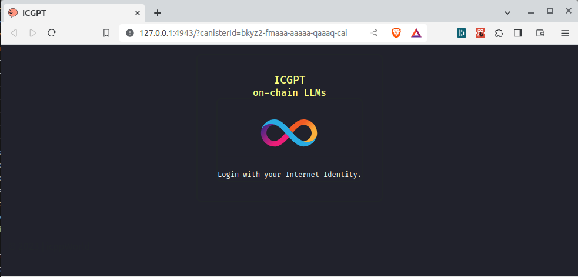

# ICGPT


---

[Try it out on the IC](https://icgpt.icpp.world) !

---

The full application consists of 2 GitHub repositories:
1. [icgpt](https://github.com/icppWorld/icgpt)  (This repo)
2. [icpp_llm](https://github.com/icppWorld/icpp_llm)

# Setup

## Conda

[Download MiniConda](https://docs.conda.io/en/latest/miniconda.html#linux-installers) and then install it:

```bash
bash Miniconda3-xxxxx.sh
```

Create a conda environment with NodeJS & Python 3.11:

```bash
conda create --name icgpt nodejs python=3.11
conda activate icgpt
```

## git

```bash
git clone git@github.com:icppWorld/icgpt.git
cd icgpt
```

### pre-commit

Create this pre-commit script, file `.git/hooks/pre-commit`

```bash
#!/bin/bash

# Apply all static auto-formatting & perform the static checks
export PATH="$HOME/miniconda3/envs/icgpt/bin:$PATH"
/usr/bin/make all-static
```

and make the script executable:

```bash
chmod +x .git/hooks/pre-commit
```

## toolchain & dependencies

Install the toolchain:

- The dfx release version is specified in `dfx.json`

```bash
conda activate icgpt
make install-all  # for Ubuntu. 
                  # see Makefile to replicate for other systems

# ~/bin must be on path
source ~/.profile

# Verify all tools are available
dfx --version

# verify all other items are working
conda activate icgpt
make all-static-check
```

# Development

## The backend LLM canisters

ICGPT includes LLM backend canisters of [icpp_lmm](https://github.com/icppWorld/icpp_llm):
- Clone [icpp_lmm](https://github.com/icppWorld/icpp_llm) as a sibling to this repo
- Follow instructions of [icpp_llama2](https://github.com/icppWorld/icpp_llm/tree/main/icpp_llama2) to :
  - Build the wasm
  - Get the model checkpoints

The following files are used by the ICGPT deployment steps:
```
../icpp_llm/icpp_llama2/src/llama2.did
../icpp_llm/icpp_llama2/build/llama2.wasm
../icpp_llm/icpp_llama2/scripts/upload.py

#
# For each of the backend canisters you're including
#
../icpp_llm/icpp_llama2/stories260K/stories260K.bin
../icpp_llm/icpp_llama2/stories260K/tok512.bin

../icpp_llm/icpp_llama2/tokenizers/tokenizer.bin
../icpp_llm/icpp_llama2/models/stories15M.bin
../icpp_llm/icpp_llama2/models/stories42M.bin
../icpp_llm/icpp_llama2/models/stories110M.bin
```

## Deploy to local network

Once the files of the backend LLMs are in place, as described in the previous step, you can deploy everything with:

```bash
# Start the local network
dfx start --clean

# In another terminal

# Deploy all wasms listed in dfx.json
dfx deploy

# Upload the LLM models to the backend canisters
make upload-260K-local
make upload-15M-local
make upload-42M-local
make upload-110M-local
# Or alternatively
make upload-all-local

# Note: you can stop the local network with
dfx stop
```


After the deployment steps described above, the full application is now deployed to the local network, including the front-end canister, the LLM back-end canisters, and the internet_identity canister: 

You can now open the front-end in the browser at the URL printed by the deploy script:



When you login, just create a new II, and once login completed, you will see the start screen shown at the top of this README. Now you can play with it and have some fun !


## Front-end Development

The front-end is a react application with a webpack based build pipeline. Webpack builds with sourcemaps, you can also use the following front-end development workflow:

- Deploy the full application to the local network, as described in previous step
- Do not open the front-end deployed to the local network, but instead run the front-end with the npm development server:

  ```bash
  # from root directory
  
  conda activate icgpt
  
  # start the npm development server, with hot reloading
  npm run start
  
  # to rebuild from scratch
  npm run build
  ```

- Open the browser at the URL printed & open the browser devtools for debugging

- Make changes to the front-end code in your favorite editor, and when you save it, everything will auto-rebuild and auto-reload


### Styling with Dracula UI

All front-end color styling is done using the open source Dracula UI:
- [github](https://github.com/dracula/dracula-ui)
- [user guide](https://ui.draculatheme.com/)

# Deployment to IC

Step 0: When deploying for the first time:
- Delete **canister_ids.json**, because when you forked or cloned the github repo [icgpt](https://github.com/icppWorld/icgpt), it contained the canisters used by our deployment at https://icgpt.icpp.world/

Step 1: Build the backend wasm files
- Clone [icpp_llm](https://github.com/icppWorld/icpp_llm/) and follow the instructions in [icpp_llama2](https://github.com/icppWorld/icpp_llm/tree/main/icpp_llama2) to build the wasm for each backend canister.

Step 2: Deploy the backend canisters
- Note that **dfx.json** points to the wasm files build during Step 1
  ```bash
  # Deploy
  dfx deploy --ic llama2_260K -m reinstall
  dfx deploy --ic llama2 -m reinstall
  dfx deploy --ic llama2_42M -m reinstall
  dfx deploy --ic llama2_110M -m reinstall

  # Upload the LLM models to the backend canisters
  make upload-260K-ic
  make upload-15M-ic
  make upload-42M-ic
  make upload-110M-ic
  # Or, alternatively
  make upload-all-ic
  ```

Step 3: deploy the frontend
- Now that the backend is in place, the frontend can be deployed
  ```bash
  # from root directory
  conda activate icgpt

  dfx identity use <identity-of-controller>

  # This deploys just the frontend!
  dfx deploy --ic canister_frontend
  ```

# Appendix A - NOTES

## process.env.CANISTER_ID_<NAME>

The generated declarations and in our own front-end code the canister Ids are defined with `process.env.CANISTER_ID_<NAME>`.

The way that these environment variables are created is:
- The command `dfx deploy` maintains a section in the file `.env` where it stores the canister id for every deployed canister.
- The commands `npm build/run` use `webpack.config.js`, where the `webpack.EnvironmentPlugin` is used to define the values.

## Internet Identity

icgpt is using internet identity for authentication.

When deploying locally, the internet_identity canister will be installed automatically during the `make dfx-deploy-local` or `dfx deploy --network local` command. It uses the instructions provided in `dfx.json`. 

When deploying to IC, it will NOT be deployed.

For details, see this [forum post](https://forum.dfinity.org/t/problem-insalling-internet-identity-in-local-setup/20417/18).

